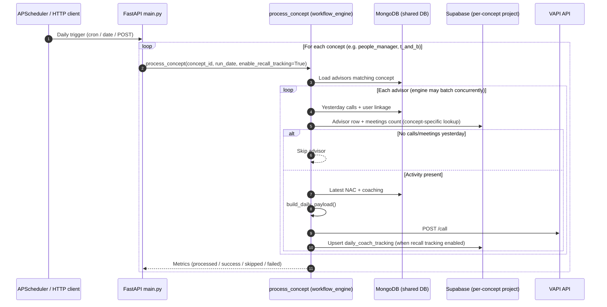
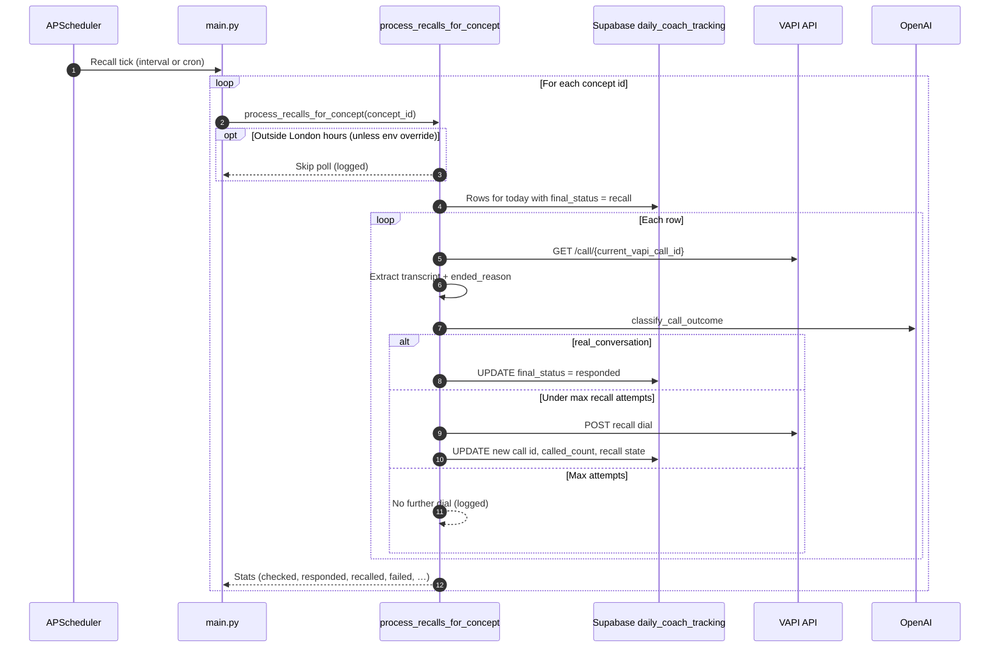

# Advisor orchestration — sequence flows, runtime model, and deployment options

This document summarizes how the application behaves end-to-end, how it should run in production (especially scheduling), and how **Railway** compares to **AWS** for hosting this workload.

---

## 1. Architecture overview

The service is a **FastAPI** application (`main.py`) that orchestrates:

- **MongoDB** (shared): advisors, yesterday’s calls, NAC feedback, coaching payloads.
- **Supabase** (per concept): separate projects for People Manager vs T&B — users/meetings lookups and **`daily_coach_tracking`** persistence.
- **VAPI**: outbound voice calls with `daily_payload` in assistant overrides.
- **OpenAI**: recall-time classification of transcript vs voicemail vs no-response.

Scheduling is handled by **APScheduler** inside the FastAPI **lifespan** when `ENABLE_SCHEDULER` is enabled. Alternatively, operators can trigger the same pipelines via HTTP (`POST /run-all`, `/run/{concept}`, etc.).

---

## 2. Sequence diagrams

The diagrams use Mermaid syntax (render in GitHub, VS Code, or any Mermaid-capable viewer).

### 2.1 Daily batch (all concepts)

Triggered by:

- **Cron** (`DAILY_CRON`) or **one-shot delay** (`SCHEDULER_DAILY_FIRST_RUN_DELAY_SECONDS`), or  
- **HTTP** `POST /run-all` / concept routes (same underlying workflow).

### 2.2 Recall poll (per concept)

Runs on **interval** (`RECALL_POLL_INTERVAL_SECONDS`) or **cron** (`RECALL_POLL_CRON`) when interval is unset. Skips outside London working hours unless overridden by environment.

---

## 3. How the application should run (production checklist)

### 3.1 Process model

- Use **one long-lived process** (container/VM) with the scheduler enabled, **or** split later into “API-only” vs “scheduler worker” replicas.
- **Do not** run multiple identical replicas all with `ENABLE_SCHEDULER=1` **without** coordination: each replica would register the same APScheduler jobs and can **duplicate** daily runs and recall polls.

**Recommended:** a **single replica** (or explicitly one “scheduler” service) running the full app with `ENABLE_SCHEDULER=1`.

### 3.2 Environment (example for 09:00 London daily + recall every 30 minutes)

| Variable | Example | Notes |
|----------|---------|--------|
| `ENABLE_SCHEDULER` | `1` | Starts APScheduler in lifespan |
| `SCHEDULER_TZ` | `Europe/London` | Timezone for cron triggers |
| `DAILY_CRON` | `0 9 * * *` | Five fields: minute hour day month day-of-week — **09:00** London |
| `RECALL_POLL_INTERVAL_SECONDS` | `1800` | **30 minutes** (overrides cron if set) |
| Or `RECALL_POLL_CRON` | `*/30 * * * *` | Only used when interval is **not** set |

Optional: `SCHEDULER_SKIP_DAILY_CRON`, `SCHEDULER_DAILY_FIRST_RUN_DELAY_SECONDS` (tests or delayed first batch), `RECALL_MAX_CALL_ATTEMPTS`, London hours override for recall.

### 3.3 Secrets and multi-tenant data

- **Per concept Supabase**: `PM_SUPABASE_*`, `TB_SUPABASE_*` (URLs and **service_role** keys).  
- **Server-side automation** must use **`service_role`** for the relevant project — not the publishable **anon** key — or writes to `daily_coach_tracking` can fail with permission errors.
- **VAPI**, **OpenAI**, **Mongo** URIs — store in platform secret manager / env, not in images.

### 3.4 OS-level `cron` vs in-app scheduler

You typically **do not** need Linux `cron` **in addition** to APScheduler for the same jobs: the app already schedules daily and recall intervals. External cron is useful only if you **remove** in-process scheduling and trigger **HTTP endpoints** instead (different architecture).

---

## 4. Railway vs AWS (for this app)

Neither platform is universally “better”; the choice depends on operational maturity and existing cloud footprint.

| Dimension | Railway | AWS (e.g. ECS Fargate, EC2, EventBridge) |
|-----------|---------|------------------------------------------|
| **Time to first deploy** | Very fast: connect repo, env vars, deploy | Slower: accounts, VPC, IAM, pipelines, load balancers |
| **Operational complexity** | Low: PaaS manages much of runtime | Higher: you own more of networking, scaling, IAM |
| **Fit for this scheduler** | Good: run **one** always-on web/worker service, `ENABLE_SCHEDULER=1` | Good: run **one** task/service for scheduler; same caveats on replica count |
| **Scaling HTTP** | Add replicas carefully if scheduler runs on same service | Same; often split API (N replicas) vs scheduler (1 replica) |
| **Enterprise / compliance** | Adequate for many teams; check policies | Strong: VPC, private subnets, KMS, audit, enterprise support |
| **Cost predictability** | Simple plans; watch always-on usage | Fine-grained; can be cheaper at scale with rightsizing |
| **Integrations** | Straightforward for small/medium stacks | Deep: RDS, Secrets Manager, EventBridge, Lambda, etc. |

**Practical guidance**

- Choose **Railway** (or similar PaaS: Fly.io, Render) if the priority is **minimum friction** and a **single-region** deployment with **one** instance running the scheduler.
- Choose **AWS** if you already standardize on AWS, need **VPC isolation**, **private database connectivity**, strict **IAM**, or expect to grow into **EventBridge-triggered** jobs and **multi-service** layouts.

For **09:00 daily + 30-minute recall**, both platforms only require a **stable 24/7 container** and correct **environment variables**; the scheduling behavior is defined by the **application**, not by the host brand.

---

## 5. Document maintenance

- When `main.py` or `workflow_engine.py` changes job registration or recall rules, update **Section 2** and **Section 3** accordingly.
- Sequence diagrams are illustrative; refer to source for exact field names and edge cases (e.g. max recall attempts, London hours gate).
